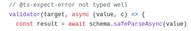

[see on jsr](https://jsr.io/@nik-kita/hono-zod-middleware-monkey-patch)

### ...this is simple ugly monkey-patch...

#### why?

[This awesome package during integration with deno project has little ts incompatibility](https://github.com/honojs/middleware/tree/main/packages/zod-validator)

- **suppose this place:**

So I've decided to fix it by myself.

#### how?

# add `any` type in this place... :D
